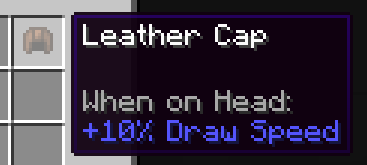

# RangedWeaponAPI

### 🏹 Making bows and crossbows has never been easier!

## Features

### Ranged weapons
- [x] Bows and Crossbow construction
- [x] Customizable weapon properties: damage, pull time, projectile velocity (optional)
- [x] Automatic item model predicate registration (matching vanilla model predicates)
- [x] Tooltip includes weapon properties
- [x] Correct rendering first and third person rendering
- [x] Correct pull FOV
- [ ] AI can use these weapons


### Attributes

- [x] Ranged Damage attribute
  - ID: `ranged_weapon:damage`
  - Specifies the damage amount of projectiles, randomized by the same relative amount as vanilla weapons, critical strike mechanic applies the same way
- [x] Draw Speed attribute 
  - ID: `ranged_weapon:haste`
  - Base value = 100
  - Example values: 50, -50% attack speed 
  - Example values: 200, +100% attack speed

`/give @a minecraft:leather_helmet[attribute_modifiers={modifiers:[{type:"ranged_weapon:haste",amount:0.2,slot:head,id:"armor_head_bonus",operation:add_multiplied_base}]}]`



Each attribute has a corresponding status effect.

`/effect give @p ranged_weapon:damage`


`/effect give @p ranged_weapon:haste`


## Try it out

Check out this repo, resolve dependencies, select `Testmod client` run config.


Use `/give @p testmod:custom_longbow` to get a test bow.

## Installation

Add this mod as dependency into your build.gradle file.

Repository
```groovy
repositories {
    maven {
        name = 'Modrinth'
        url = 'https://api.modrinth.com/maven'
        content {
            includeGroup 'maven.modrinth'
        }
    }
}
```

Dependency
```groovy
dependencies {
    modImplementation "maven.modrinth:ranged-weapon-api:${project.ranged_weapon_api_version}"
}
```

## Usage

1. Create your bow/crossbow instance
2. Configure it
3. Register it
4. Add model and texture files
5. Done!

```java
    var bow = new CustomBow(
        new Item.Settings().maxDamage(300),
        new RangedConfig(30, 9, 0),
        () -> Ingredient.ofItems(Items.GOLD_INGOT)
    );
    Registry.register(
        Registries.ITEM,
        Identifier.of(NAMESPACE, "custom_longbow"), 
        bow
    );
```

Check out the [example mod](src/testmod/java/net/testmod/TestMod.java).

## Include or depend

Feel free to include this API in your mod, the license allows you to do so.

If you want to say thank you, you can link this project as a dependency on Modrinth/CruseForge, so downloads are counted for this project too.

Mod ID: `ranged_weapon_api`

Modrinth dependency (gradle entry): `required.project 'ranged-weapon-api'`

CurseForge dependency (gradle entry): `requiredDependency 'ranged-weapon-api'`